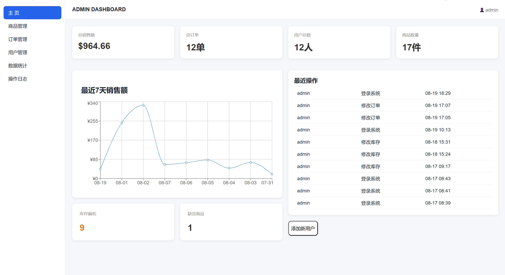
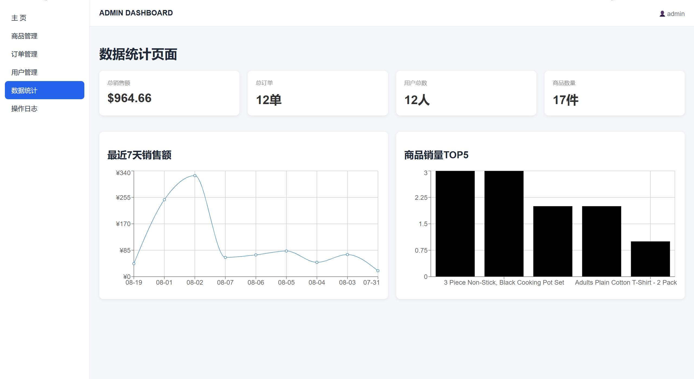
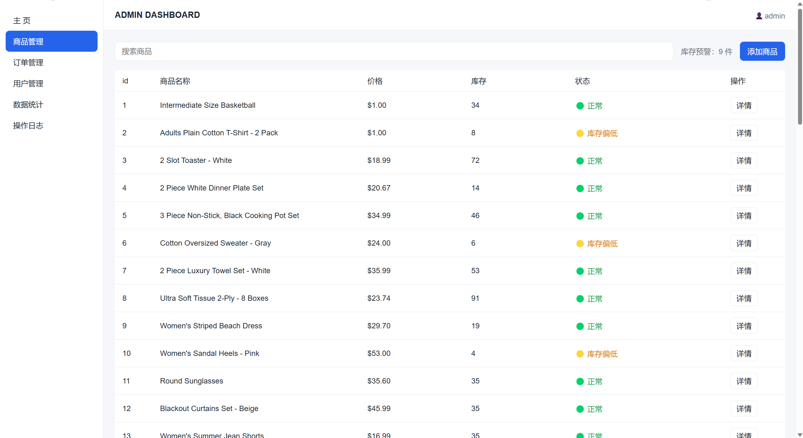

# Admin Dashboard

一个基于 **React + TypeScript + Vite** 开发的后台管理系统，包含商品管理、用户管理、订单管理、数据统计、操作日志等核心功能。

项目采用前后端分离架构，前端部署于 **Vercel**，后端使用 **JSON Server** 模拟 REST API，并部署于 **Render**。

## 🌐 在线预览

* **在线 Demo：** https://admin-dashboard-flame-one-40.vercel.app/
* **API：** https://admin-dashboard-api-i82z.onrender.com/
* **GitHub：** https://github.com/R1Kka1/admin-dashboard

> ⚠️ **首次访问说明**
>
> 后端 API 部署于 Render 免费实例，长时间无访问后可能进入休眠状态。
>
> 首次打开 Demo 时，后端可能需要几秒钟唤醒。如果首次请求失败，请等待几秒后刷新页面重试。

---
## 📸 项目截图
### 主页



### 数据统计



### 商品管理



## ✨ 核心功能

### 🔐 登录与权限

* 用户登录
* Token 模拟认证
* 登录状态管理
* React Router 路由守卫
* 基于角色的权限控制
* 管理员 / 超级管理员权限区分
* Axios 请求拦截器自动携带 Token
* Axios 响应拦截器统一处理 HTTP 错误
* 登录过期自动清理本地登录状态

### 📦 商品管理

* 商品列表展示
* 商品搜索
* 新增商品
* 删除商品
* 修改商品库存
* 修改商品价格
* 商品库存状态提示
* 商品表单验证
* 商品数据异常处理

### 👤 用户管理

* 用户列表展示
* 用户搜索
* 新增用户
* 修改用户信息
* 删除用户
* 用户角色管理
* 用户状态管理
* 用户表单验证

### 🛒 订单管理

* 订单列表
* 订单详情
* 商品信息关联
* 修改订单状态
* 订单数据统计
* 商品删除后的关联数据异常处理

### 📊 数据统计

* 销售额统计
* 商品销量统计
* 销售趋势展示
* 数据汇总
* 使用 Recharts 实现数据可视化
* 使用 dayjs 处理时间数据

### 📝 操作日志

* 记录管理员操作
* 动态获取当前操作用户
* 操作时间记录
* 操作类型记录
* 操作内容记录

### ⚙️ 通用能力

* Loading 加载状态
* Error 错误处理
* Toast 操作反馈
* Axios 请求统一封装
* 自定义 Hooks
* 通用表单验证
* 环境变量配置
* TypeScript 类型约束
* React Router SPA 路由
* Vercel + Render 云端部署

---

## 🛠️ 技术栈

### Frontend

* React 19
* TypeScript
* Vite
* React Router
* Axios
* Recharts
* dayjs
* CSS

### Backend

* JSON Server
* REST API

### Development & Deployment

* Git
* GitHub
* Vercel
* Render
* npm

---

## 🏗️ 项目架构

项目采用前后端分离架构：

```text
┌─────────────────────┐
│      React SPA      │
│   React + TypeScript│
└──────────┬──────────┘
           │
           │ Axios
           ↓
┌─────────────────────┐
│      REST API       │
│     JSON Server     │
└─────────────────────┘

        Deployment

┌──────────────┐       ┌──────────────┐
│    Vercel    │       │    Render    │
│   Frontend   │ ───→  │   Backend    │
└──────────────┘       └──────────────┘
```

---

## 📁 项目结构

```text
admin-dashboard/
├── public/
│
├── src/
│   ├── api/              # Axios 请求封装
│   ├── components/       # 通用组件
│   ├── hooks/            # 自定义 Hooks
│   ├── layout/           # 页面布局
│   ├── pages/            # 页面模块
│   ├── types/            # TypeScript 类型定义
│   ├── utils/            # 工具函数
│   ├── App.tsx
│   └── main.tsx
│
├── db.json               # JSON Server 数据
├── vercel.json           # Vercel 配置
├── package.json
├── tsconfig.json
├── vite.config.ts
└── README.md
```

---

## 🔑 主要实现

### Axios 请求封装

项目通过 Axios 创建统一的请求实例，对 API 请求进行集中管理。

请求拦截器会自动读取本地 Token，并添加到请求头：

```text
Authorization: Bearer <token>
```

响应拦截器统一处理常见 HTTP 错误，例如：

* 401：登录过期
* 403：权限不足
* 404：资源不存在
* 500：服务器错误

减少页面组件中的重复错误处理逻辑。

---

### 🛡️ 路由与权限控制

使用 React Router 实现 SPA 路由，并通过路由守卫控制页面访问权限。

主要包括：

```text
登录状态
   ↓
PrivateRoute
   ↓
是否已登录
   ↓
RoleRoute
   ↓
是否拥有对应角色权限
```

不同角色可以访问不同的后台功能。

---

### 📝 统一表单验证

将表单验证逻辑抽离为通用验证工具，根据不同字段组合验证规则。

目前支持：

* 必填校验
* Email 格式校验
* 最小长度
* 最大长度
* 数值范围
* 自定义验证规则

避免在不同 Modal 中重复编写验证逻辑。

---

### 🧩 自定义 Hooks

将页面中的数据请求和状态管理逻辑抽离到自定义 Hooks 中。

例如：

```text
useUsers
useProducts
useLogs
```

降低页面组件复杂度，提高代码复用性和可维护性。

---

### 📊 数据可视化

使用 Recharts 实现后台数据统计，包括：

* 销售额
* 商品销量
* 销售趋势
* 数据汇总

使用 dayjs 对订单时间进行格式化和统计。

---

### 📝 操作日志

系统会记录管理员的重要操作，例如：

```text
新增商品
修改商品价格
修改库存
删除商品
修改用户
修改订单状态
```

操作日志中的操作员从当前登录用户动态获取，而不是写死管理员名称。

---

## 🌱 TypeScript 重构

项目后期由 JavaScript 逐步迁移至 TypeScript。

为核心业务数据建立类型定义，例如：

```text
User
Product
Order
Log
```

同时对 API 请求、Hooks、组件 Props、表单验证规则等进行类型约束。

通过 TypeScript 减少数据结构错误，提高项目的可维护性。

---

## 🚀 本地运行

### 1. 克隆项目

```bash
git clone https://github.com/R1Kka1/admin-dashboard.git

cd admin-dashboard
```

### 2. 安装依赖

```bash
npm install
```

### 3. 配置环境变量

在项目根目录创建：

```text
.env
```

添加：

```env
VITE_API_BASE_URL=http://localhost:3001
```

### 4. 启动 JSON Server

```bash
npm run server
```

默认 API 地址：

```text
http://localhost:3001
```

### 5. 启动前端

新开一个终端：

```bash
npm run dev
```

访问：

```text
http://localhost:5173
```

---

## 🔧 环境变量

项目使用 Vite 环境变量区分开发环境和生产环境。

### 本地开发

```env
VITE_API_BASE_URL=http://localhost:3001
```

### 生产环境

在 Vercel 中配置：

```env
VITE_API_BASE_URL=https://admin-dashboard-api-i82z.onrender.com
```

`.env` 已加入 `.gitignore`，不会提交到 GitHub。

---

## 🌐 项目部署

### Frontend

前端使用 Vercel 部署。

GitHub `main` 分支更新后，Vercel 会自动触发构建和部署。

### Backend

后端使用 Render 部署 JSON Server。

启动命令：

```bash
npm start
```

线上 API：

```text
https://admin-dashboard-api-i82z.onrender.com
```

---

## 🔄 部署流程

```text
        GitHub
        /    \
       ↓      ↓
   Vercel    Render
      ↓         ↓
 React SPA   JSON Server
      │         │
      └── Axios ┘
           ↓
        REST API
```

修改项目后：

```bash
git add .
git commit -m "your commit message"
git push
```

GitHub 更新后：

```text
GitHub
  ↓
Vercel / Render
  ↓
自动重新部署
```

---

## ⚠️ Render 冷启动

由于后端使用 Render 免费实例，服务在长时间没有请求后可能进入休眠状态。

因此首次访问线上 Demo 时可能出现：

```text
首次请求
   ↓
Render 实例休眠
   ↓
等待服务器唤醒
   ↓
首次请求可能超时
   ↓
刷新页面后恢复正常
```

如果首次进入页面出现登录失败或请求失败，可以等待几秒后重新刷新页面。

---

## 📌 项目亮点

* 使用 **React + TypeScript** 构建完整后台管理系统
* 使用 **React Router** 实现 SPA 路由与路由守卫
* 使用 **RoleRoute** 实现基于角色的权限控制
* 使用 **Axios 实例 + 请求/响应拦截器**统一处理 API 请求
* 使用 **TypeScript** 对核心业务数据和 API 进行类型约束
* 使用 **自定义 Hooks** 抽离数据请求和业务逻辑
* 抽离通用 **表单验证工具**，统一处理表单校验
* 使用 **Loading / Error / Toast** 完善异步操作反馈
* 使用 **Recharts + dayjs** 实现数据统计与可视化
* 实现商品、用户、订单等核心模块 CRUD
* 使用 JSON Server 模拟 REST API，实现前后端分离
* 使用环境变量区分本地开发与生产环境
* 完成 **Vercel + Render** 云端部署
* 解决 React Router 部署后的 SPA 路由刷新问题
* 针对 Render 免费实例增加冷启动处理说明

---

## 📚 项目收获

通过该项目系统实践了：

* React Hooks
* TypeScript
* React Router
* Axios
* REST API
* CRUD
* RBAC 权限控制
* 表单验证
* 异步请求
* Loading / Error / Toast
* 自定义 Hooks
* 数据可视化
* Git / GitHub
* 前后端分离
* 环境变量
* Vercel / Render 部署

---
